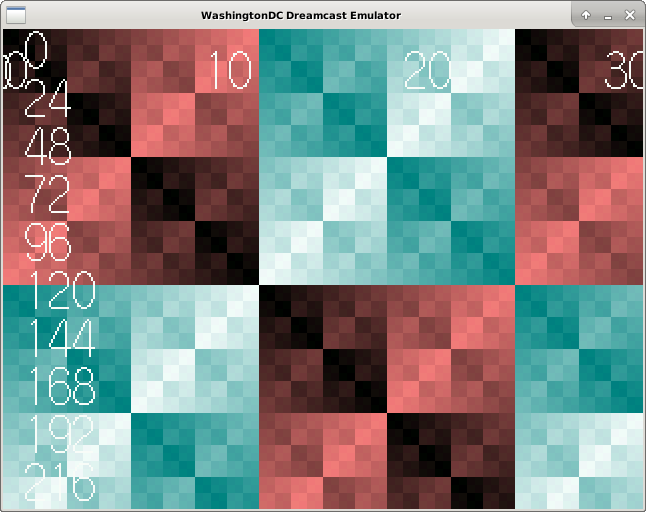
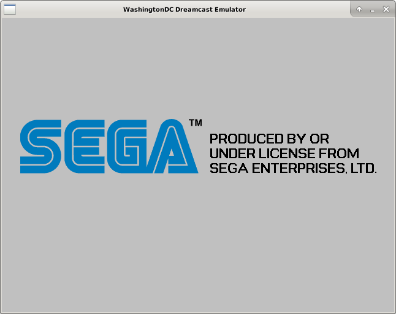
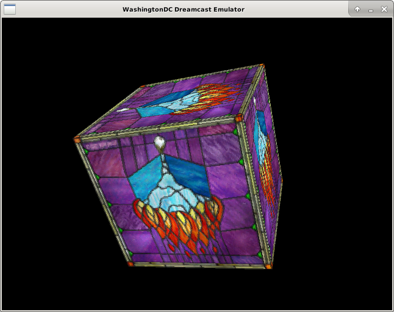
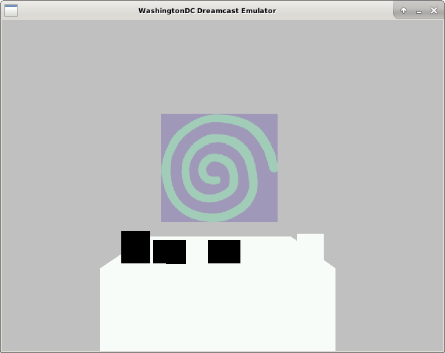
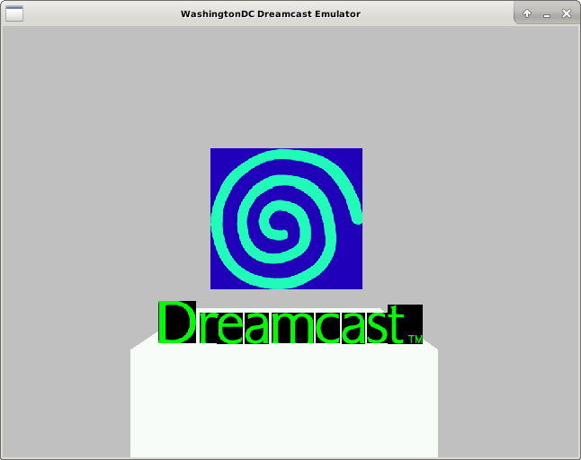
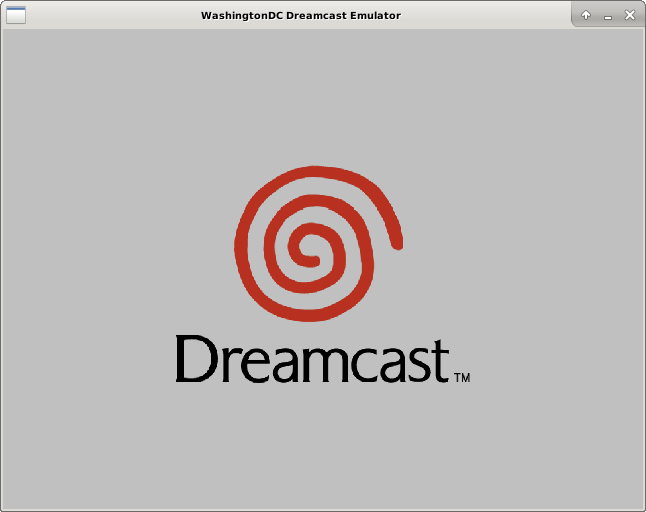
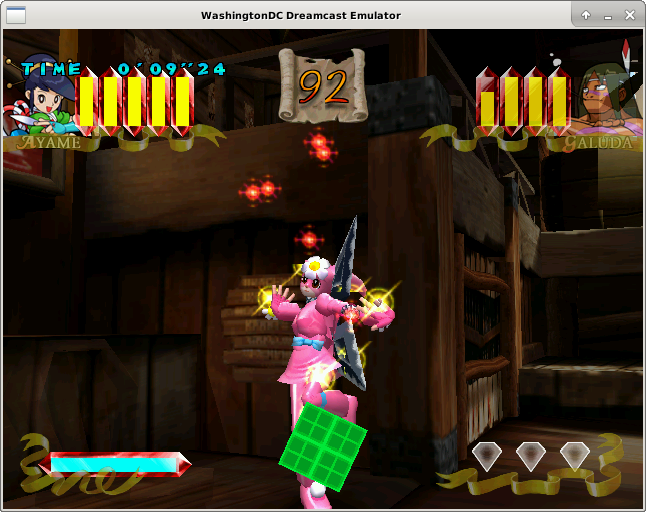
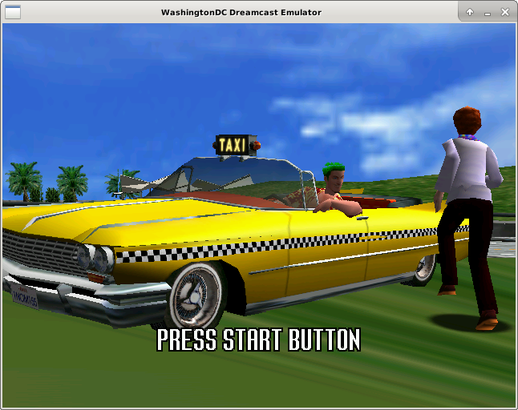

WashingtonDC is an in-development SEGA Dreamcast emulator I started
working on almost a year ago as a pet project.  It's my first attempt at
emulation development, and I'm quite pleased with the progress I've made
so far.  This is something I started last year as a pet project.  It's the
most complicated program I've ever worked on, and a year ago I didn't know
if it was going to work out, or if it would turn out to be a waste of
time.

On October 14 2016, I started with nothing and begin
implementing some basic CPU opcode handlers and a simple memory device.
I didn't have enough infrastructure at that point to run real Dreamcast
programs, so I wrote a test function for each opcode which would send it a
randomized input, execute an instruction, and check the output to see if
it matches expectations.  These test functions constituted more than half
of WashingtonDC's source for the first few months, and ultimately grew to
become a 10000+ line file before they outlived their usefulness.  This
testing system also included its own SH4 assembler so that I could
specify the assembler directives in plain-text.

The assembler proved to be surprisingly difficult to implement, and I
remember spending an entire weekend panicking over it because I had never
written this much code before and I was worried it would come to dominate
the entire project.  In retrospect it wasn't that big of a deal because
it only came out to approximately 3k-lines and got mostly written over the
course of that single weekend, but at the time it felt like a major
undertaking.

Eventually I had approximately half of the opcodes implemented, so I used
the opcode handlers to implement a simple CPU interpreter.  This interpreter
would load a firmware dump (dc_bios.bin) and a flash dump (dc_flash.bin)
from a file and begin decoding/executing the firmware one instruction at a
time.  It's designed to print an error-dump and exit every time it sees
something it doesn't recognize so I know to go figure out what just
failed and implement it.  To make forward progress, I would run the
firmware through the interpreter and observe the output when it failed.
Usually the failure cause would be some unimplemented functionality, so
I'd implement it and then re-run the firmware; it would then make it
slightly further before failing again on some other thing that I would
need to implement.  The goal was to continue this cycle until I could boot
the firmware.

Not all of the problems I encountered were related to unimplemented
opcodes or unimplmented memory-mappings.  Some of them were the result of
mistakes I had made.  Trying to debug a CPU interpreter when something
goes wrong can be difficult when you don't even have access to the source
code, so I decided to skip the firmware for now and make my emulator boot
directly to a homebrew program (which it does by loading the program into
memory where the firmware would have put it and pointing the SH4's program
counter at the beginning).  The Dreamcast has the best homebrew community
of any classic game console, and part of that community is an open-source
SDK called [KallistiOS](http://gamedev.allusion.net/softprj/kos/).

KallistiOS is a sort of lightweight OS kernel that provides high-level
APIs for interacting with the Dreamcast hardware, as well cooperative
multithreading, filesystems, networking and a host of other features.
Having access to the source code made it a lot easier for me to debug
issues caused by bugs in WashingtonDC.  KallistiOS also gives me an easy
way to run code on a real Dreamcast system so I can test for consistency
between WashingtonDC and Dreamcast.

What's really great is that since KallistiOS' cross-compiler toolchain is
based off of GNU, it generates standard ELF binaries complete with
GDB-compatible debugger symbols.  To leverage this, I wrote a remote GDB
backend for WashingtonDC; it connects with GDB using GDB's remote
debugging protocol over TCP via localhost, and it provides GDB with a way
to interact with the state of the emulated Dreamcast.  On the GDB-side of
this connection, there's a normal GDB client (with SH4 support enabled),
and I can control the execution of the program runnign inside of
WashingtonDC's virtual machine just like it's running on my local machine;
that includes breakpoints, watchpoints, single-stepping, memory-access,
register access and even ELF symbol lookup (which the GDB client
implements entirely independently from my GDB stub using the lower-level
functionality my GDB stub provides it with).

Eventually WashingtonDC could boot through KallstiOS' initialization and
get to the homebrew program's main function.  I didn't have graphics at
this time, so I implemented the SCIF, which is a UART on the SH4 which
connects to the serial port on the back of the Dreamcast.  KallistiOS
sends its printf output to the SCIF so you can connect a null modem from
your Dreamcast to your PC and view the output on your PC.  My SCIF
implementation sends that output over TCP to a telnet session so I can
use telnet to watch the nessages KallistiOS prints when it boots.

The examples directory in KallistiOS' source includes several homebrew
programs which demonstrate how to use KallistiOS.  One of them is a port
of the classic BSD text adventure,
[Colossal Cave Adventure](https://en.wikipedia.org/wiki/Colossal_Cave_Adventure)
which became the first game to work on WashingtonDC when I implemented the
serial port.

With KallistiOS booting, I had a way to run my own programs in
WashingtonDC or on a real Dreamcast in a high-level environment; this was
a huge boon for testing and reverse-engineering.  I kept moving forward
a little bit at a time by getting more and more of KallistiOS' example
programs to work.  I got framebuffer graphics working, which allowed me
to see visual output from some of KallistiOS' example programs such as
this:

More importantly, this meant I had enough infrastructure to run the
SEGA bootstrap program that is included in every Dreamcast game.
This program is commonly referred to as IP.BIN within the context of
homebrew development.  It resides in the ISO9660 filesystem's first
32-kilobytes.  When the Dreamcast firmware loads a game, it first runs
some simple authentication tests whcih are designed to stop software
pirates and homebrew developers from running unauthorized code off of CD-R
discs (hackers figured out how to circumvent these checks a long time ago)
and then it loads IP.BIN from the disc.  IP.BIN's job is to draw a SEGA
logo to the framebuffer along with the words "PRODUCED BY OR UNDER LICENSE
FROM SEGA ENTERPRISED, LTD" and then load the game off of the disc.

It wasn't actually loading the game because I didn't have the GD-ROM code
working yet, but it was drawing that logo.  This was the first time I had
a "real" Dreamcast program running in my emulator.  At this point in time,
the date was April 14. 2017 and I was just now starting to get visual
feedback from WashingtonDC after 6 months of work.

I kept moving forward with remaining unimplemented features such as the
GD-ROM drive, the PowerVR2 GPU (which does 3D graphics rendering), and
the remaining unimplemented opcodes (which at this point were mostly just
the SH4's floating-point unit).  For these, KallstiOS was once again a
huge help because I could use its source to understand what exactly
programs expected these components to do.  MAME's PowerVR2 code was also
a huge help.  After another couple of months I was running some of the
KallistiOS demos that made use of the PowerVR2, such as this port of one
of the classic NeHe OpenGL tutorials:

Eventually, I felt like I had enough infrastructure to go back to trying
to boot the BIOS, so I gave it a try and this happened:

I immediately recognized this as a distorted version of the Dreamcast's
"spiral swirl" bootup animation.  After about a day spent fixing up the
PowerVR2 code, I got this image which confirmed I was watching the
firmware's bootup animation:

And after another day, I actually had a working spiral-swirl:

From there it wasn't long until I had the Real-Time Clock reset screen
and the main firmware menu working.  This was in mid-July, so it took me a
total of 9 months to get to the point where I finally had something which
I could honestly consider a working Dreamcast emulator.

Over the past three months, I've been working to get actual games booting.
The first game I got working was Power Stone.  I don't have the AICA
(audio hardware) implemented yet, and Power Stone (along with most other
games) doesn't boot without working audio hardware.  Actually
implementing the audio hardware will be time-consuming because it has its
own dedicated CPU I have not yet implemented.  I was feeling impatient
after 9+ months of development, so instead I implemented a hack to fool it
into thinking the audio hardware is present by editing the AICA's memory
to show Power Stone what it wants to see (thus fooling it into thinking
the program it loaded onto the AICA's ARM7 processor is talking back to
it).  This hack works, and it allows me to get in-game in
both Power Stone and Crazy Taxi (and maybe other games, too).

A year ago I started this project not knowing if I would be able to create
a working Dreamcast emulator.  Now I have one and I look forward to
turning it into a usable platform in terms of both compatibility and
performance.  Currently WashingtonDC can run two games, and it runs both
of them at approximately 8% of the speed of a real Dreamcast on my humble
3.1GHz AMD Bulldozer.  I hope by this time next year WashingtonDC can be a
truly viable Dreamcast emulator, able to run a significant portion of the
Dreamcast library at full-speed.

For the immediate future, my goals are to add the analog stick and analog
triggers to my controller implementation (which currently only supports
the digital buttons on the Dreamcast's gamepad) and then get started on a
JIT compiler which can convert sh4 machine-code into x86_64 machine-code.
With the JIT compiler implemented, WashingtonDC should be running
siginificantly faster than it is now and it will be feasible to get the
audio hardware working (if I got the audio hardware working now, it's
doubtful I'd be able to hear anything due to the pitch-shifting from
running significantly slower than a real Dreamcast).
