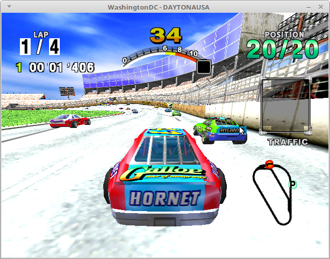
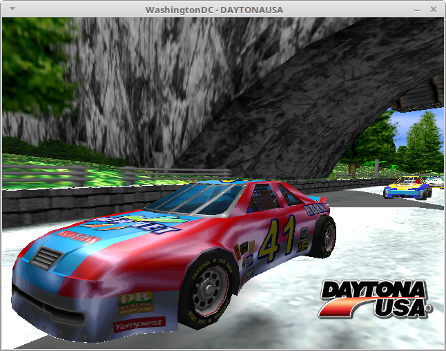
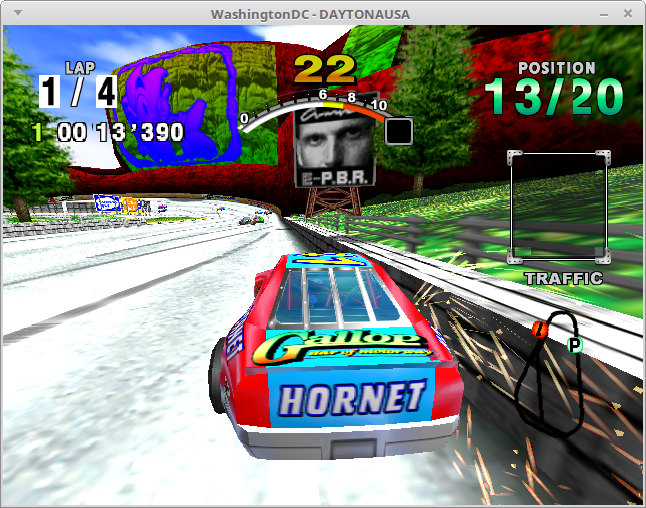

Wow, it's already been five months since I wrote the post about
regression testing!  This site might not have changed much, but
there's been a lot going on with WashingtonDC in that time.  When I wrote
that last update, WashingtonDC was barely rendering the Dreamcast's
spiral-swirl bootup at a mere 8% speed (on my PC).  Back then WashingtonDC
only had a simple interpreter.  Now it has a dynamic recompiler
(sometimes called a dynarec) which crushes the spiral-swirl at an average
speed of 140%.  That's faster than a real Dreamcast!

In-game performance isn't quite as perfect as bootup performance; you can
generally expect that to swing between 30% and 60%.  I think the main
bottleneck there is the FPU; all of its opcodes are implemented by
calling into the interpreter's FPU opcode handlers.  This brings in all
the overhead of a function call, plus the overhead of not being able to
hold stuff in registers for long periods of time, plus the overhead of
having to branch based on whether the FPU is configured for single or
double precision on every instruction.  I imagine that can add up and
turn into a bottleneck even though it's just one subset of the SH4's
instruction-set.

Most importantly, I just got Daytona USA booting a couple nights ago!  A
lot of the textures are being rendered with the wrong colors, but
Three-Seven Speedway still has its classic charm.  I haven't gotten any
new games working since Crazy Taxi started working way back in September
(or was it October?), so I'm excited to finally have a third game in my
testing set alongside Crazy Taxi and Power Stone.

Beyond that, there are a bunch of games which are booting, but
can't make it ingame.  Puyo Puyo~n shows a message in Japanese (which I
think is it complaining about the VMU not being plugged in) before
failing due to unimplemented functionality.
Evolution: The World of Sacred Device bitches about the VMU not being
plugged in and then flashes the logos of its developers before ultimately
failing due to unipmlemented functionality.  Shenmue and Jet Set Radio
both display "Now Loading" screens before failing (due to unimplemented
functionality, of course).  Twinkle Star Sprites technically gets in-game,
but the graphics are heavily corrupted.

I didn't quite get around to finishing the regression tests I was talking
about in my last post;  I don't think I've touched them since January.  I
need to keep my time balanced between auxiliary stuff like that and
exciting stuff like making progress.  Naturally, the boring auxiliary
stuff gets way less attention compared to exciting things like a faster
recompiler and booting new games.  I'll get back around to it some day.

The primary thing that keeps WashingtonDC from booting most games is the
ARM7 CPU.  This is a relatively unadvanced 45MHz RISC machine which is
wired into the Dreamcast's audio system (AICA).  Games can load whatever
code they want onto the ARM7 to control AICA.  Most games will end up
hanging indefinitely without this because the SH4 spins forever waiting
for the program it just loaded onto ARM7 to respond.  I get around this by
manually hacking the AICA memory to show games what they want to see (so
they think the ARM7 program is responding) but this is only feasible for
a very small set of games, and if you actually want the audio to work then
it's not feasible for any games at all.

I don't anticipate that it will be difficult to implement ARM7 emulation,
but I do expect it will be difficult to keep this and the SH4 in sync
with each other.  I've been making a lot of infrastructure changes to
support this and I still have more work to do before I can begin
implementing the ARM7 in earnest.

After that the obvious next steps are to get the audio working, and to
get WashingtonDC running at a smooth 60FPS on typical games.  I want to
have WashingtonDC ready for a release (insomuch as you can "release"
something that's been sitting in a publicliy-accessible github repo since
2016) on 11/27/2018.  That's the twentieth anniversary of Dreamcast's
Japanese launch, so it's the perfect date to launch a Dreamcast emulator.
That gives me 202 days, which is a tight schedule but I ought to be able
to get WashingtonDC to a level of basic functionality by then.

I also intend to overhaul this site and have a real regularly-updated
development blog going like other emulator projects.  I might end up
moving to a dedicated blogging platform or I might overhaul this webpage
into something less spartan.  Whatever I do, I probably won't get around
to it until after I have the ARM7 working at the earliest.  Ever since I
got started way back in October 2016 I've been treating WashingtonDC like
my hobby project, but going forward I'm going to have to start treating it
as a product (albeit an open-source product that doesn't make any money).

To that end, I think I need a new name.  "WashingtonDC" has always been a
placeholder name which I chose because it has DC in it, and also because I
was watching the 2016 Presidential Debates when I got started.  I don't
actually live in Washington DC or even Washington state so it feels a bit
dishonest to keep calling it that.  In my head, I tend to abbreviate it
to "wash", so I'm thinking of rebranding WashingtonDC as washDC, with the
logo being a wave (of water) curled over to vaguely resemble a Dreamcast
logo.  The other benefit of this is that I'll get better search-engine
results if my emulator doesn't share a name with the capital of the
United States (as somebody on /r/emulation astutely pointed out back in
February).
