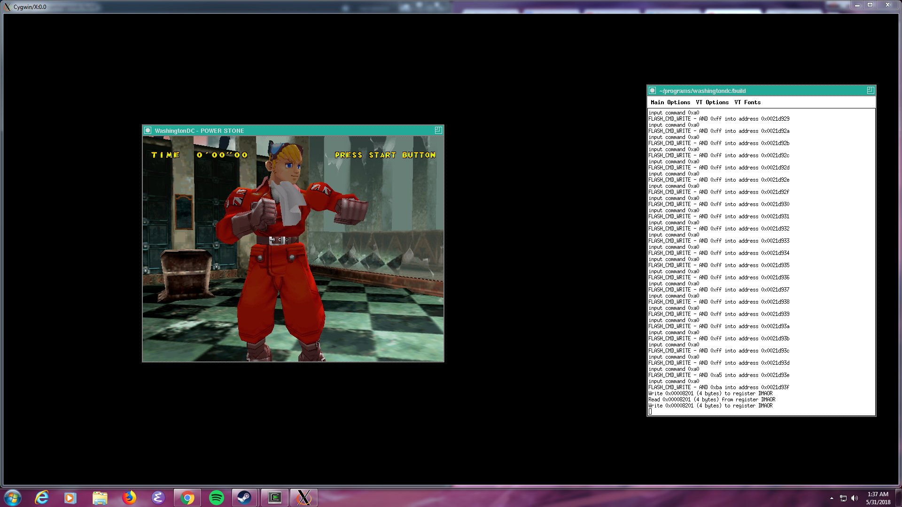

This blog update is actually about a month and half late because I got
this working way back in late May, but WashingtonDC is finally workin in
Windows via Cygwin.

It runs really slow (which I think is because OpenGL might be using a
software rasterizer under cygwin) but it does have a working x86_64
backend for the dynarec so I can use this as a starting point to gradually
get a native Windows port running.

Going forward, I think the roadmap is going to be to get WashingtonDC to
build in mingw and then later get it working under MSVC.  The main
roadblock is going to be that MSVC doesn't implement C11 and it doesn't
really even implement C99 very well.  I don't really know what the
solution to this is going to be.  I'm rather fond of C11, so if I can get
things running fast enough in mingw then I just might never bother with
MSVC.  The dynarec is going to emit the same code regardless of what
compiler it was built with itself, so I might find there is a negligible
difference between MSVC and mingw for my purposes.

I still hope to have WashingtonDC ready for a release in time for the
Dreamcast's 20th birthday in November.  That only leaves me a little over
four months to get it to a usable state, so I'm thinking Windows support
might not be available in the first release.  Build systems and GUIs tend
to be the two biggest time-sinks in software development even though
there's no reason why they should, so I'm worried that the effort needed
to get the Windows port boostrapped might cause me to miss my target date.

