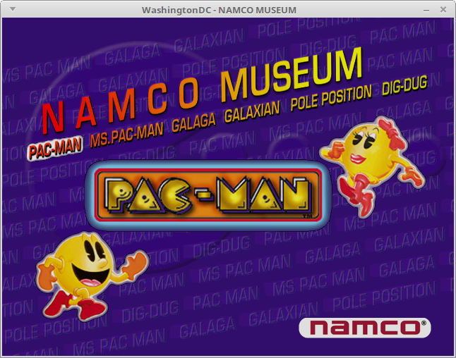
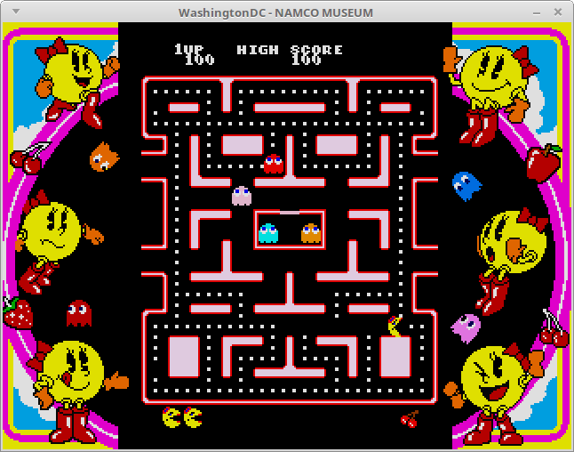
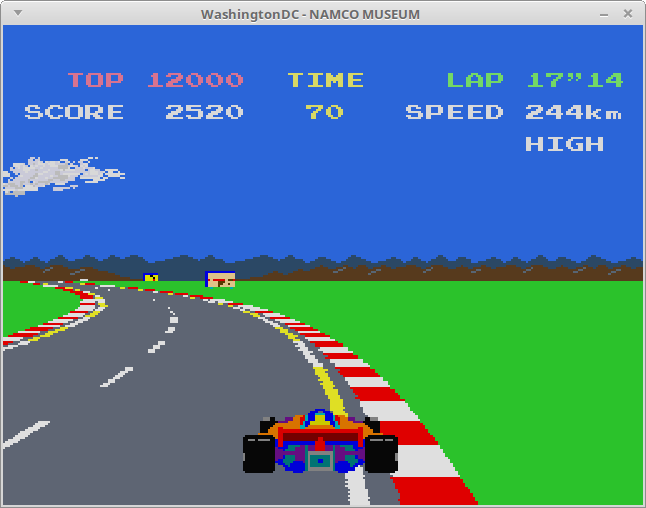
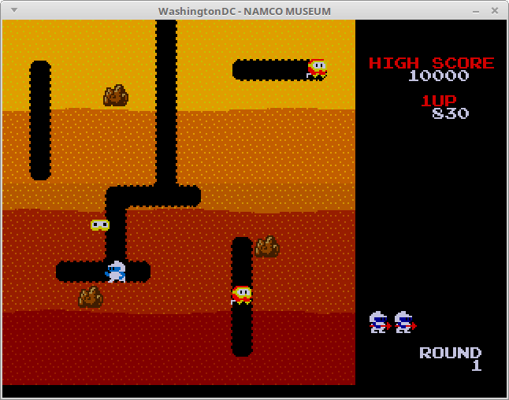
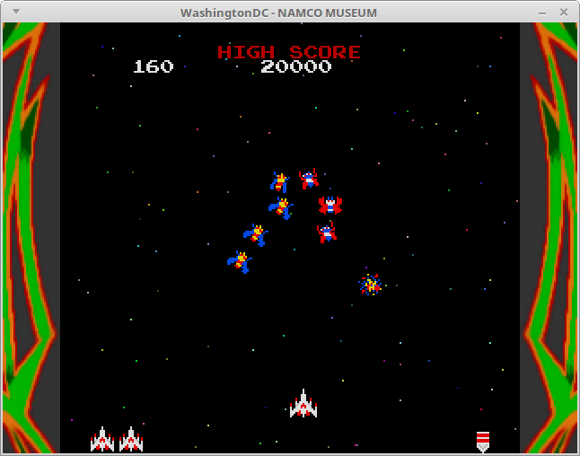

Namco Museum has joined Crazy Taxi, Daytona USA, and Power Stone to become
the fourth (known) game to get in-game in WashingtonDC.  This game was
previously unbootable because WashingtonDC was exposing a bug in the game
itself.  All of WashingtonDC's IRQs happen instantly, and it seems that
was causing this game to miss a PowerVR2 interrupt and hang forever.

Now I have PowerVR2 IRQs running on a 1 millisecond delay, and as a result
this game can boot and go in-game.  Other IRQs are still happening
instantly for now because I haven't bothered to get good measurements for
how long they generally take on real hardware.  I don't really even know if
1 millisecond is too long or too short for the PowerVR2 IRQs.

This game exposed some bugs in WashingtonDC that had to be fixed.  There
are two remaining problems with this game that need to be fixed.  One of
them is a soft hang that only happens with the JIT enabled.  I think
that's a self-modifying code problem, caused by the game not clearing out
the instruction after overwriting program memory.  The other bug involves
the spinning logos at the beginning disappearing when they stop spinning.
That's being caused by the screen getting cleared when it shouldn't have.
I need to run some more hardware tests to figure out exactly what's
supposed to be happening there, but it looks like I don't have the tile
rendering implemented correctly.

There were a couple other games that had the same IRQ timing bug as Namco
Museum.  Since those are finally unblocked, I'm going to get some of them
in-game as well so I have more test-cases before I move on to finishing
AICA.  The next game will probably be either Soul Calibur or Star Wars
Episode I Racer.

