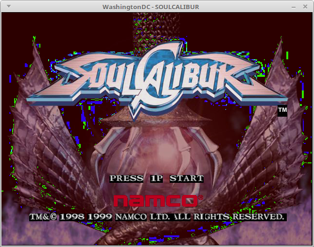
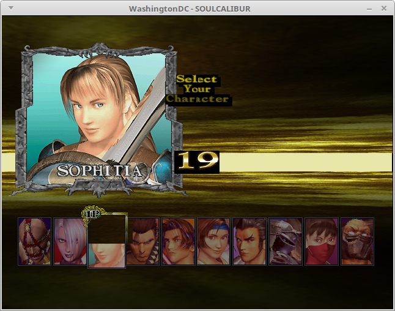
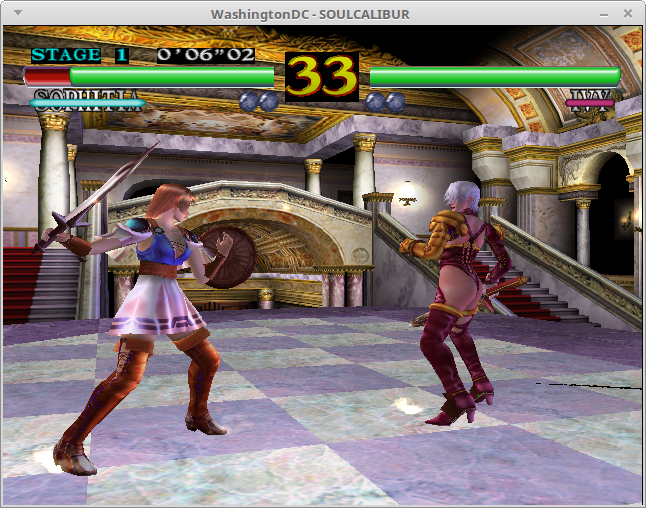
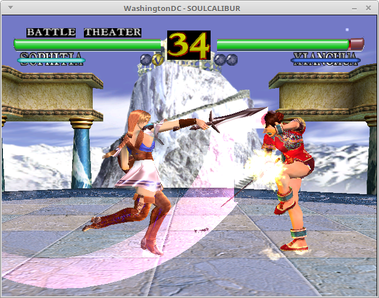
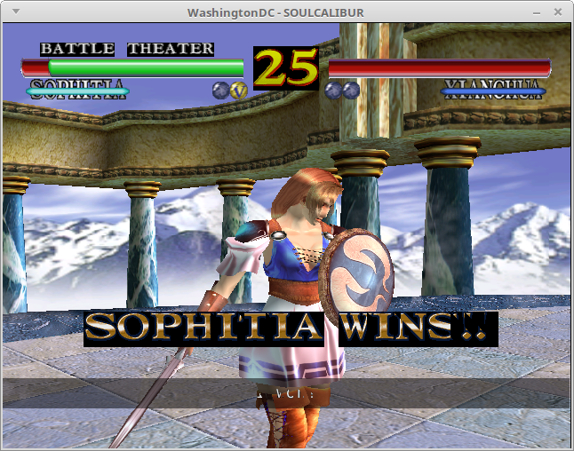
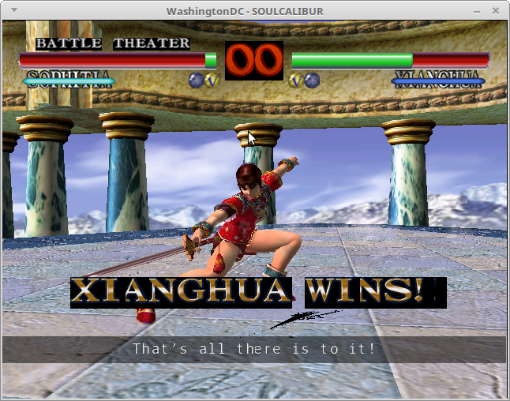

Here's SoulCalibur running on the snickerbockers/soulcalibur branch.  This
game does some strange things with the PowerVR2's TAFIFO register, so to
get it working I had to make some changes which *might* not be correct.
One of those changes ended up breaking Crazy Taxi, so I need to do some
more research and development before this can get merged into master.

