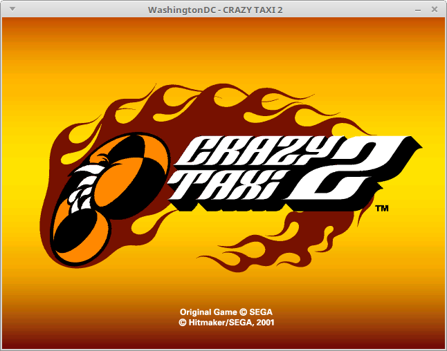
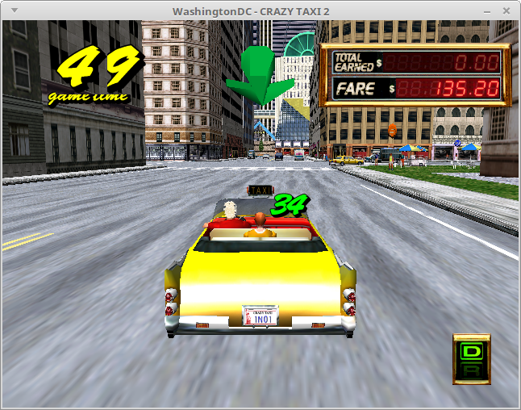
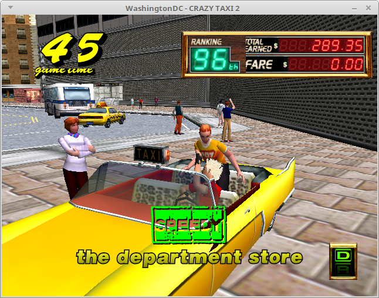
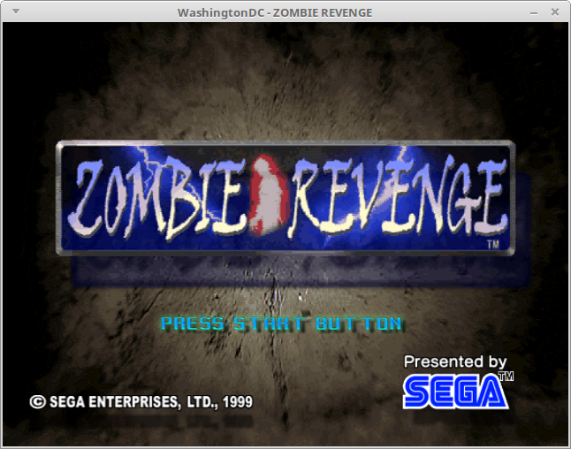
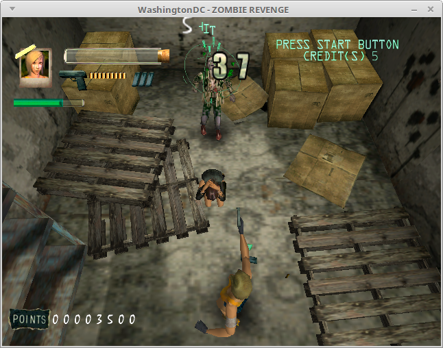
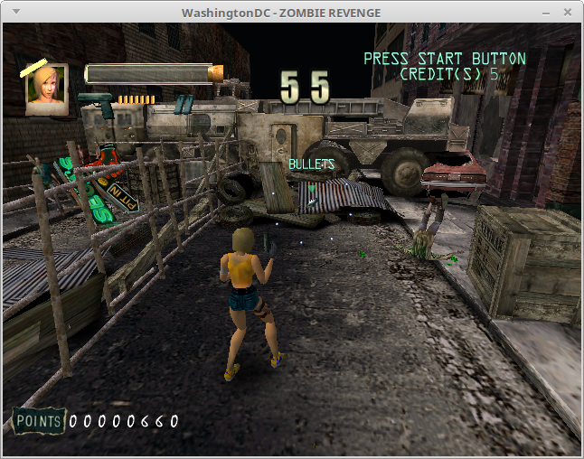

Looks like we got ourselves a twofer in today's snickerblog update!
Crazy Taxi 2 and Zombie Revenge are both games which I tried to run for
the first time in the past week and both of them got in-game without
needing any changes to WashingtonDC, so probably they've both been working
for a while now and I just didn't know it.

Both of these games remain Dreamcast exclusives to this day.  Zombie
Revenge is a beat-emu-up game set in the world of House of the Dead.
Crazy Taxi 2 is largely similar to its predecessor, except it's set in
New York City instead of San Francisco and there are some new game
mechanics thrown in.

