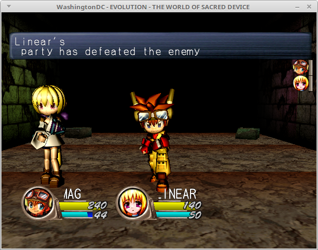

Evolution is now in-game.  This is a JRPG featuring a cast of cute
characters and randomly-generated dungeons.  It has some really memorable
music, too (not that you'd know playing it on WashingtonDC...I still
haven't implemented sound yet).  Some of the enemies look like they
belong in a PSX game, but the main party is pretty high-polygon and the
lighting model this game uses looks amazing.

The technological improvement that made this game playable in
WashingtonDC was the implementation of the PowerVR2's YUV420 converter.
What this does is implement part of the MPEG/JPEG image compression in
hardware.  Specifically, it doubles the vertial chrominance sampling and
interleaves the luminance and chrominance channels together into a format
that PowerVR2 can sample from as a texture.  Evolution uses this YUV
converter to show an intro cinematic of Mag and Linear entering the
dungeon at the beginning of the game.  Unfortunately, the still movie
doesn't actually get displayed becase the game sees that there's
something wrong with the audio hardware (which there is, because I
haven't implemented it yet) and gives up on showing it right after it
begins.  Nevertheless, I still had to get the YUV converter working
so the game can proceed because the game does actually try to show
movie before it realises there's no audio hardware.

BTW, one interesting fact about this game: it got ported to the Neo Geo
Pocket Color, of all platforms.  In the waning years of SEGA's hardware
days, they gave up on trying to beat the Game Boy and threw their weight
behind SNK's handheld platform instead.  Neo Geo Pocket Color received
this, a 2D Sonic game, and Puyo Puyo Tsu (and probably more SEGA stuff
too, those three are just all I can name off the top of my head).  I
haven't had the pleasure of trying out the NGPC port of Evolution, but
from what I've seen it does a great job of remaking Evolution's 3D
graphics as old-school pixel art.

