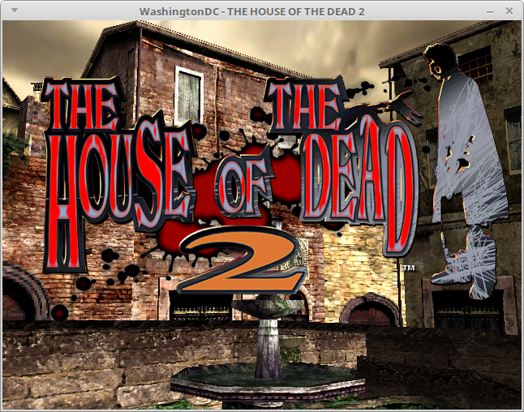
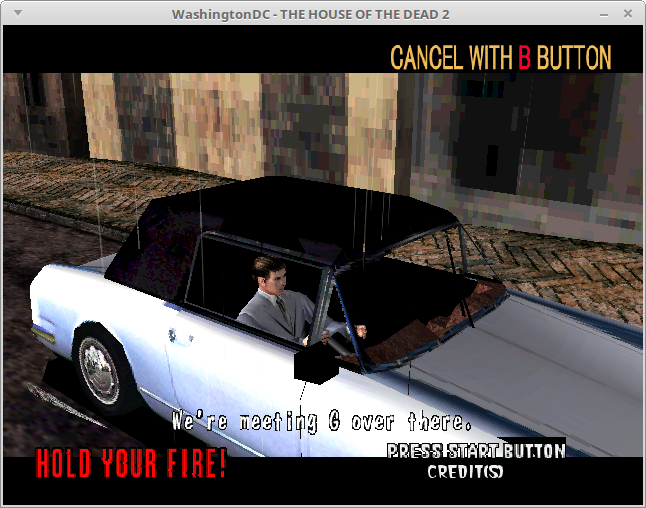
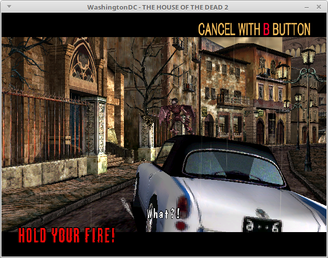
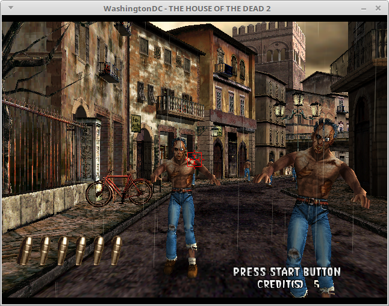
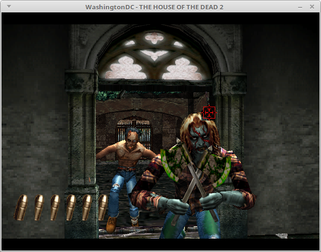
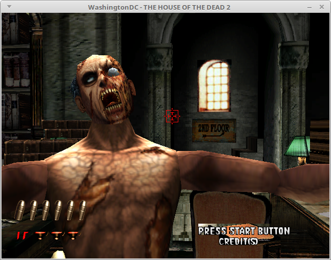

I just discovered that HotD2 is in-game.  As with Zombie Revenge and
Crazy Taxi 2, this is a game which worked the first time I tried it,
meaning that it has probably been working for a while and I just didn't
know it.

The House of the Dead 2 is a lightgun shooter.  I don't have the lightgun
implemented in yet but this game also lets you play with the controller
by using the analog stick to move an on-screen cursor, and that does work
in WashingtonDC.

Things have been going a little slower this month due to some IRL things
getting in the way: a really tough project at work, Bay Area gaming/anime
conventions, and most recently a crippling Monster Hunter World addiction.
I think I'll have more time for WashingtonDC in September but even now I'm
making sure to get some progress made every day even if it's something
minor like fixing bugs in the remote gdb stub.  My current focus is on the
AICA, which is Dreamcast's audio system.  I already have AICA's CPU, the
ARM7 working but the actual audio hardware is mostly unimplemented.  I
suspect that most games which aren't working aren't working because the
AICA implementation is incomplete.

