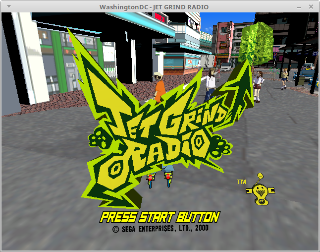
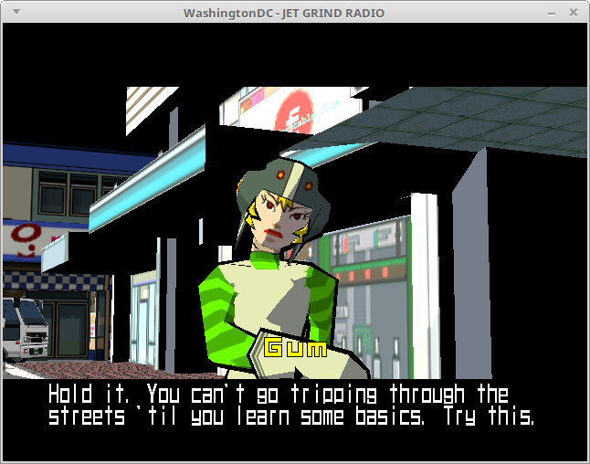
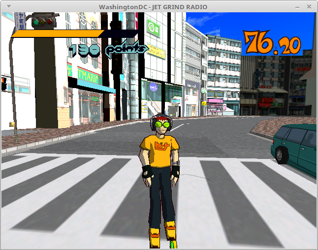
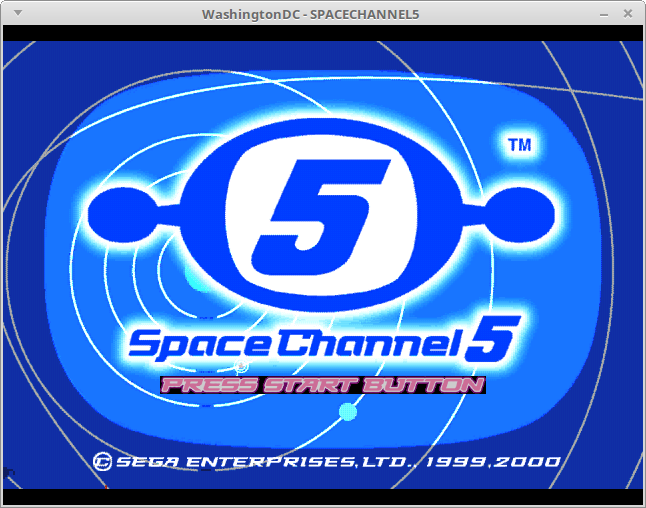
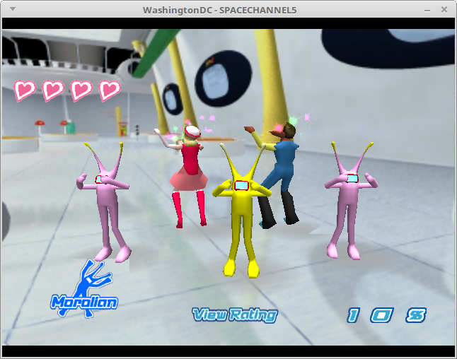
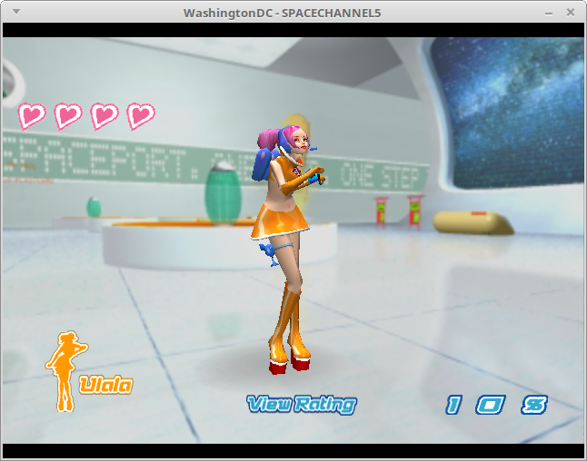
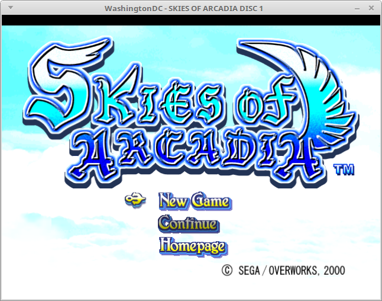
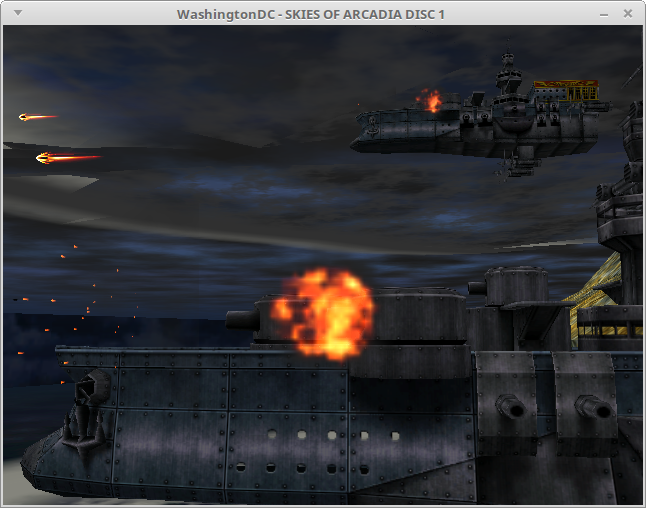
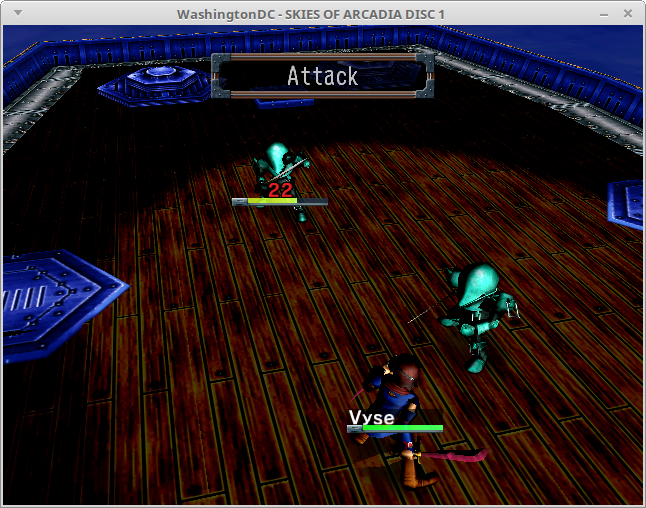

I've mentioned before in previous snickerblog posts that the reason why
so many games don't even boot in WashingtonDC is that I've yet to
implement the AICA audio hardware.  I'm working on getting that done in
the snickerbockers/aica_audio branch over on github.  On that branch, I
recently implemented sample timer interrupts which go to the ARM7, and
that has unblocked at least three games.  Jet Set Radio, Space Channel 5
and Skies of Arcadia are now in-game on the aica_audio branch.
Additionally, the full SoulCalibur intro movie now plays.  Previously, it
would end prematurely after the camera goes over Mitsurugi's shoulder
during the first shot and then go straight to the title screen.

There's still a lot of stuff unimplemented in this branch, and it doesn't
actually play audio yet.  I think this will get merged to master when
there is working audio even if I don't have all the AICA hardware
implemented yet.

